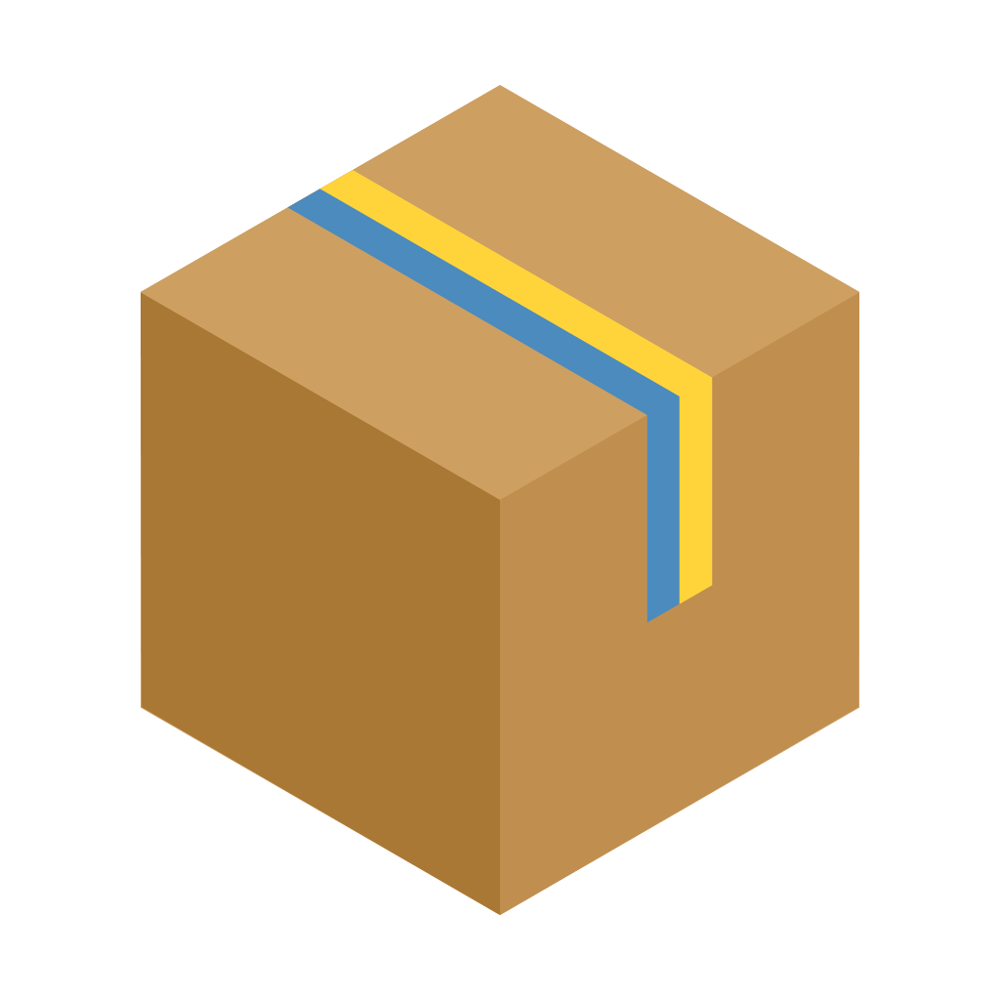

<!-- BACKTOTOP -->

<!-- SHIELDS -->
[![Contributors][contributors-shield]][contributors-url]
[![MIT License][license-shield]][license-url]
[![Version][version-shield]][version-url]

<!-- LOGO AND LINKS -->
 

  

  <h3 align="center">py-in-a-box</h3>

  

    TUIs inside the web browser!
     
    <a href="https://github.com/k01e-01/py-in-a-box/wiki"><strong>Explore the docs »</strong></a>
     
     
    <a href="https://github.com/k01e-01/py-in-a-box">View Demo</a>
    ·
    <a href="https://github.com/k01e-01/py-in-a-box/issues">Report Bug</a>
    ·
    <a href="https://github.com/k01e-01/py-in-a-box/issues">Request Feature</a>
  

<!-- TABLE OF CONTENTS -->

  
Table of Contents

  <ol>
    <li>
      <a href="#about-the-project">About the Project</a>
      <ul>
        <li><a href="#built-with">Built With</a></li>
      </ul>
    </li>
    <li>
      <a href="#getting-started">Getting Started</a>
      <ul>
        <li><a href="#installation">Installation</a></li>
        <li><a href="#documentation">Documentation</a></li>
      </ul>
    </li>
    <li><a href="#usage">Usage</a></li>
    <li><a href="#roadmap">Roadmap</a></li>
    <li><a href="#contributing">Contributing</a></li>
    <li><a href="#contact">Contact</a></li>
    <li><a href="#acknowledgments">Acknowledgments</a></li>
  </ol>

<!-- ABOUT THE PROJECT -->
## About the Project

[![Product Name Screen Shot][product-showcase]](https://github.com/k01e-01/py-in-a-box)

py-in-a-box is a hobby project I started working on back in early 2022. I created it becuase I enjoyed the "hacker feeling" of using a terminal, but also understood that it was fundamentally flawed, due to its disconnection from the internet and web browsers, so I created py-in-a-box, which solves this problem!

It works by sending user input from the client to a process on the server, and then retreiving and sending back the processes response. Due to its design it can't handle high traffic, but being dockerised you can easily scale it up if you need to!

py-in-a-box is great for:
 * small/hobby websites
 * portfolios
 * internal sites

[Duplicate this template](https://github.com/k01e-01/py-in-a-box/generate) to get started!

(<a href="#readme-top">back to top</a>)

<!-- BUILT WITH -->
### Built With

 * [![Expressjs][shellinabox-shield]][shellinabox-url]
 * [![Expressjs][textual-shield]][textual-url]
 * [![Expressjs][express-shield]][express-url]

(<a href="#readme-top">back to top</a>)

<!-- GETTING STARTED -->
## Getting Started

UNDER CONSTRUCTION

(<a href="#readme-top">back to top</a>)

<!-- INSTALLATION -->
### Installation

UNDER CONSTRUCTION

(<a href="#readme-top">back to top</a>)

<!-- DOCUMENTATION -->
### Documentation

UNDER CONSTRUCTION

(<a href="#readme-top">back to top</a>)

<!-- USAGE -->
## Usage

UNDER CONSTRUCTION

(<a href="#readme-top">back to top</a>)

<!-- ROADMAP -->
## Roadmap

UNDER CONSTRUCTION

(<a href="#readme-top">back to top</a>)

<!-- CONTRIBUTING -->
## Contributing

UNDER CONSTRUCTION

(<a href="#readme-top">back to top</a>)

<!-- CONTACT -->
## Contact

UNDER CONSTRUCTION

(<a href="#readme-top">back to top</a>)

<!-- ACKNOWLEDGMENTS -->
## Acknowledgments

UNDER CONSTRUCTION

(<a href="#readme-top">back to top</a>)

<!-- MARKDOWN LINKS & IMAGES -->
<!-- https://www.markdownguide.org/basic-syntax/#reference-style-links -->
[contributors-shield]: https://img.shields.io/github/contributors/k01e-01/py-in-a-box.svg?style=flat-square
[contributors-url]: https://github.com/k01e-01/py-in-a-box/graphs/contributors
[license-shield]: https://img.shields.io/github/license/k01e-01/py-in-a-box.svg?style=flat-square
[license-url]: https://github.com/k01e-01/py-in-a-box/blob/master/LICENSE.txt
[version-shield]: https://img.shields.io/github/v/release/k01e-01/py-in-a-box?style=flat-square
[version-url]: https://github.com/k01e-01/py-in-a-box
[product-showcase]: .github/images/demo-video.gif
[shellinabox-shield]: https://img.shields.io/badge/shellinabox-808080?style=for-the-badge
[shellinabox-url]: https://github.com/shellinabox/shellinabox
[textual-shield]: https://img.shields.io/badge/textual-7d5ab7?style=for-the-badge
[textual-url]: https://www.textualize.io/
[express-shield]: https://img.shields.io/badge/Express-000000?style=for-the-badge&logo=express
[express-url]: https://expressjs.com/